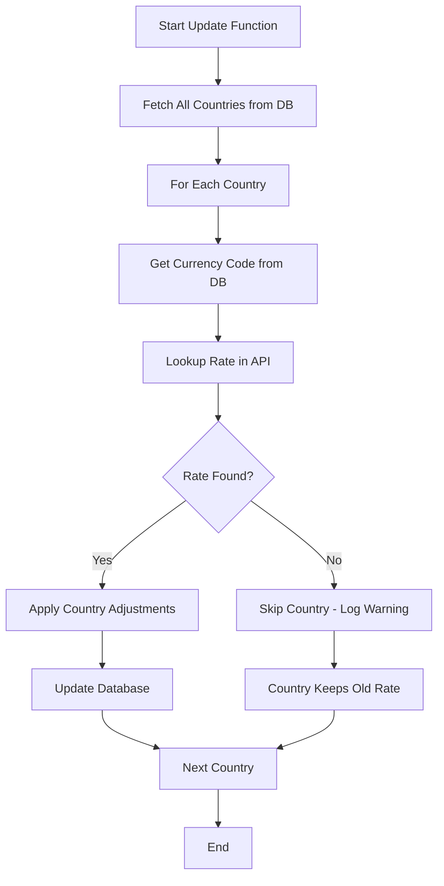

# Exchange Rate Troubleshooting Guide

## Issue: New Countries Not Getting Exchange Rates

### Problem Description
When adding new countries to `country_settings`, the exchange rate update functions don't automatically detect and update the new country's exchange rate. This results in:
- New countries having `rate_from_usd = 1.0` (default value)
- Exchange rate functions skipping these countries
- Incorrect exchange rate calculations in shipping routes

### Root Cause
**Currency Code Mismatch**: The database stores currency codes that don't match the ExchangeRate API's standard ISO currency codes.

**Example**:
- **Database**: China (CN) → `"RMB"` 
- **API**: China → `"CNY"`
- **Result**: API lookup fails, country gets skipped

### Common Currency Code Mismatches

| Country | Wrong Code | Correct Code | Impact |
|---------|------------|--------------|---------|
| China (CN) | RMB | CNY | ❌ No updates |
| Japan (JP) | YEN | JPY | ❌ No updates |
| South Korea (KR) | WON | KRW | ❌ No updates |
| India (IN) | RUPEE | INR | ❌ No updates |
| United Kingdom (GB) | POUND | GBP | ❌ No updates |
| Switzerland (CH) | FRANC | CHF | ❌ No updates |
| Russia (RU) | RUBLE | RUB | ❌ No updates |

### Detection & Resolution

#### 1. **Using the Admin Interface**
1. Go to `http://localhost:8080/admin/shipping-routes`
2. Click the **"Countries"** tab
3. Click **"Validate"** button
4. Review currency code issues
5. Click **"Fix All"** or fix individual countries

#### 2. **Using SQL Script**
```sql
-- Run the fix script
\i scripts/fix-currency-codes.sql
```

#### 3. **Manual Fix**
```sql
-- Example: Fix China's currency code
UPDATE country_settings 
SET currency = 'CNY', updated_at = NOW() 
WHERE code = 'CN';
```

### How the Exchange Rate Update Function Works



### Verification Steps

#### 1. **Check Country Settings**
```sql
SELECT code, currency, rate_from_usd, updated_at 
FROM country_settings 
WHERE code IN ('CN', 'JP', 'KR', 'IN')
ORDER BY code;
```

#### 2. **Check Shipping Routes**
```sql
SELECT 
    sr.origin_country,
    sr.destination_country,
    sr.exchange_rate,
    os.currency as origin_currency,
    ds.currency as dest_currency
FROM shipping_routes sr
JOIN country_settings os ON sr.origin_country = os.code
JOIN country_settings ds ON sr.destination_country = ds.code
ORDER BY sr.origin_country, sr.destination_country;
```

#### 3. **Test Exchange Rate Function**
```sql
-- Run the exchange rate update function
SELECT * FROM update_exchange_rates();
```

### Prevention

#### 1. **Use Standard ISO Currency Codes**
Always use the 3-letter ISO currency codes when adding new countries:
- USD, EUR, GBP, JPY, CNY, INR, etc.

#### 2. **Validate Before Adding**
Before adding a new country, check the currency code against:
- [ISO 4217 Currency Codes](https://en.wikipedia.org/wiki/ISO_4217)
- [ExchangeRate-API Supported Currencies](https://exchangerate-api.com/docs/supported-currencies)

#### 3. **Test After Adding**
After adding a new country:
1. Run the exchange rate update function
2. Verify the country's rate_from_usd is updated
3. Test creating shipping routes with the new country

### Country-Specific Notes

#### **China (CN)**
- **Correct Currency**: CNY (Chinese Yuan)
- **Common Mistakes**: RMB, YUAN, CNH
- **Current Rate**: ~7.19 CNY per USD

#### **Japan (JP)**
- **Correct Currency**: JPY (Japanese Yen)
- **Common Mistakes**: YEN, JY
- **Current Rate**: ~148.55 JPY per USD

#### **India (IN)**
- **Correct Currency**: INR (Indian Rupee)
- **Common Mistakes**: RUPEE, RS
- **Special**: Gets +3 adjustment (API rate + 3)

#### **Nepal (NP)**
- **Correct Currency**: NPR (Nepalese Rupee)
- **Common Mistakes**: RUPEE, NRS
- **Special**: Gets +2 adjustment (API rate + 2)

### Troubleshooting Checklist

- [ ] Currency code matches ISO standard
- [ ] Country exists in ExchangeRate-API
- [ ] Exchange rate function runs without errors
- [ ] rate_from_usd is updated after function runs
- [ ] Shipping routes calculate correct exchange rates
- [ ] New routes auto-calculate exchange rates

### Support

For additional help:
1. Check the Countries tab in the admin interface
2. Run the validation tool
3. Review the exchange rate logs
4. Contact system administrator if issues persist