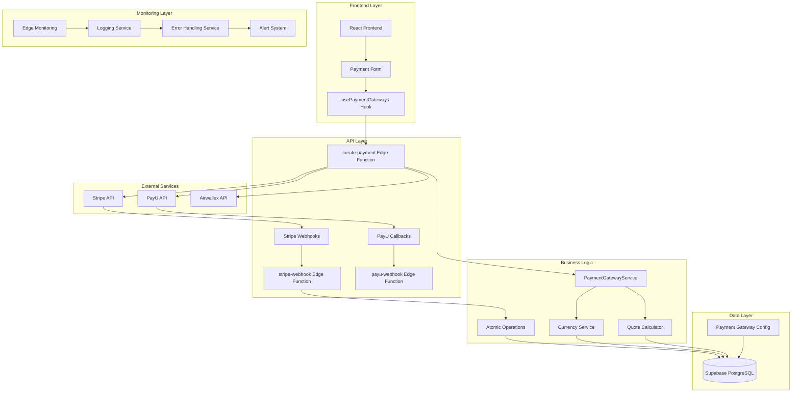
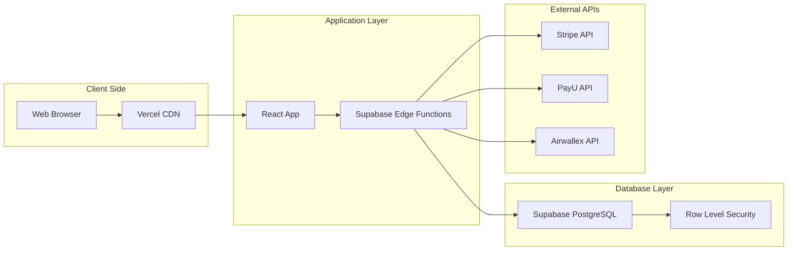
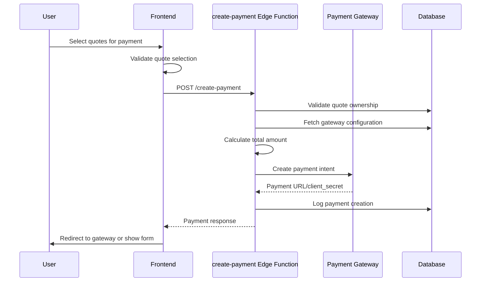
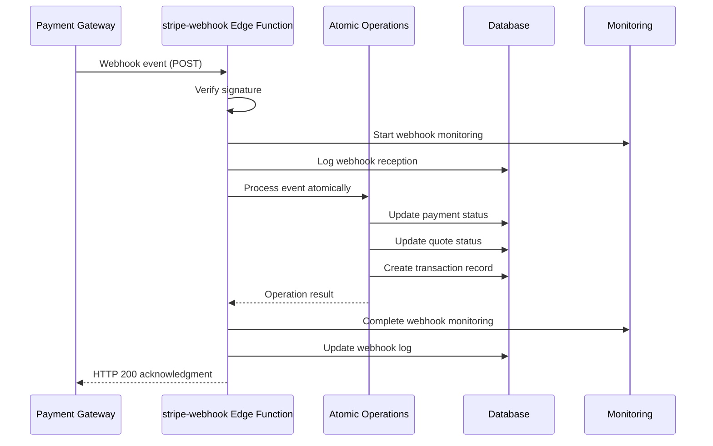
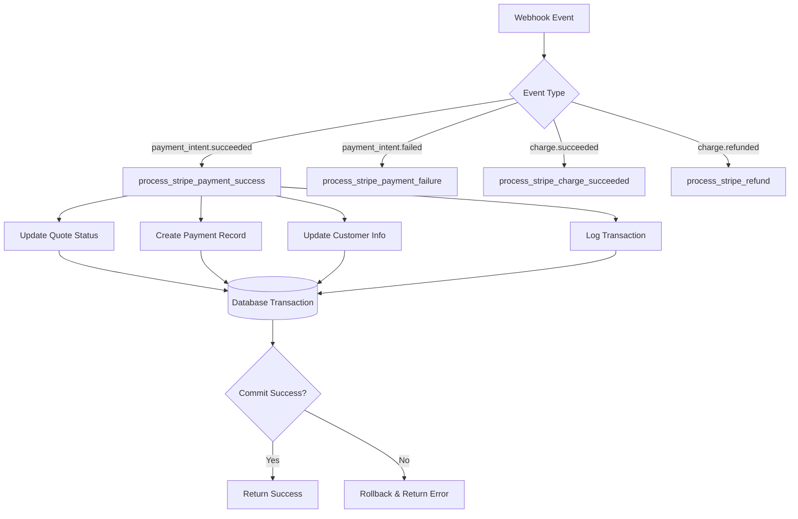
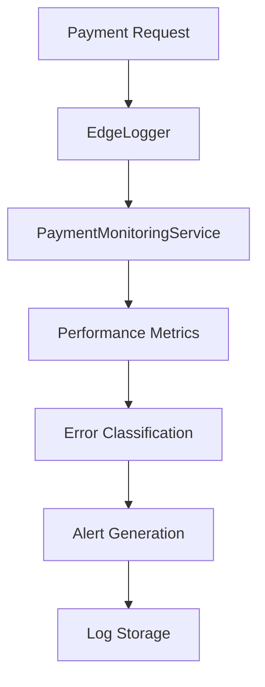

# Payment Processing Pipeline - Technical Design Document

## Document Information
- **Document Version**: 1.0
- **Last Updated**: July 2025
- **Author**: iwishBag Engineering Team
- **Status**: Active
- **Review Cycle**: Quarterly

## Table of Contents

1. [Introduction](#1-introduction)
2. [Architecture Overview](#2-architecture-overview)
3. [Key System Flows](#3-key-system-flows)
4. [Component Deep Dive](#4-component-deep-dive)
5. [Monitoring & Observability](#5-monitoring--observability)
6. [Security Framework](#6-security-framework)
7. [Error Handling & Recovery](#7-error-handling--recovery)
8. [Performance & Scalability](#8-performance--scalability)
9. [Future Enhancements](#9-future-enhancements)
10. [Appendices](#10-appendices)

---

## 1. Introduction

### 1.1 Purpose and Scope

The Payment Processing Pipeline is the core financial transaction system for iwishBag, enabling secure payment processing for international shopping services. This document provides a comprehensive technical overview of the payment architecture, covering multi-gateway integration, real-time monitoring, and atomic transaction management.

### 1.2 Business Context

iwishBag facilitates international e-commerce by allowing customers in India and Nepal to purchase products from global marketplaces (Amazon, Flipkart, eBay, Alibaba). The payment pipeline handles:

- **Multi-currency transactions** across USD, INR, NPR, and other regional currencies
- **Multiple payment gateways** including Stripe (international), PayU (India), and local methods (eSewa, Khalti, Fonepay)
- **Quote-based payments** where customers pay for pre-calculated shipping and handling quotes
- **Guest and authenticated checkout** flows

### 1.3 Key Requirements

#### Functional Requirements
- Support multiple payment gateways with automatic failover
- Handle multi-currency transactions with real-time exchange rates
- Process both individual and bulk quote payments
- Support guest checkout without user registration
- Maintain payment status synchronization across systems

#### Non-Functional Requirements
- **Reliability**: 99.9% uptime for payment processing
- **Performance**: Payment creation within 3 seconds
- **Security**: PCI-DSS compliant payment handling
- **Scalability**: Handle 1000+ concurrent payment requests
- **Monitoring**: Real-time visibility into payment success/failure rates

### 1.4 System Boundaries

**In Scope:**
- Payment gateway integration and management
- Webhook processing for payment status updates
- Quote-to-payment conversion
- Multi-currency handling and exchange rate management
- Monitoring and alerting for payment operations

**Out of Scope:**
- Fraud detection and prevention (delegated to payment gateways)
- PCI-DSS compliance implementation (handled by third-party gateways)
- Dispute management (manual process)
- Refund processing (separate workflow)

---

## 2. Architecture Overview

### 2.1 High-Level Architecture



### 2.2 Technology Stack

#### Core Technologies
- **Runtime**: Deno (Edge Functions)
- **Database**: PostgreSQL (via Supabase)
- **Authentication**: Supabase Auth
- **Frontend**: React 18, TypeScript 5, Vite

#### Payment Gateways
- **Stripe**: International credit/debit cards, Apple Pay, Google Pay
- **PayU**: India-focused (UPI, net banking, wallets)
- **Airwallex**: Multi-currency business payments
- **Local Wallets**: eSewa, Khalti, Fonepay (Nepal)

#### Monitoring & Observability
- **Structured Logging**: Custom EdgeLogger for Deno environment
- **Performance Tracking**: Built-in performance.now() API
- **Error Tracking**: Categorized error codes and alerting
- **Metrics Collection**: Custom PaymentMonitoringService

### 2.3 Deployment Architecture



### 2.4 Data Flow Overview

1. **Payment Initiation**: User selects quotes → Frontend validates → Edge Function creates payment
2. **Gateway Processing**: Payment redirects to gateway → User completes payment → Gateway processes
3. **Webhook Reception**: Gateway sends webhook → Edge Function validates → Database updates
4. **Status Synchronization**: Payment status updates propagate → Frontend reflects changes

---

## 3. Key System Flows

### 3.1 Payment Initiation Flow



#### Detailed Steps:

1. **Quote Selection & Validation**
   - User selects one or more approved quotes
   - Frontend validates quote eligibility (status = 'approved', in_cart = true)
   - Total amount calculation with currency conversion

2. **Authentication & Authorization**
   - JWT token validation for authenticated users
   - Guest session token validation for guest checkout
   - Quote ownership verification (user_id or guest session)

3. **Payment Request Processing**
   - Gateway selection based on currency and country
   - Configuration retrieval from database
   - Amount normalization for gateway requirements

4. **Gateway Integration**
   - Stripe: Create PaymentIntent with customer management
   - PayU: Generate hash and form parameters for redirect
   - Airwallex: Create payment intent with OAuth2 authentication

5. **Response Handling**
   - Success: Return payment URL or client secret
   - Failure: Return error with specific error codes
   - Monitoring: Log all operations with performance metrics

### 3.2 Webhook Processing Flow



#### Event Types Handled:

1. **payment_intent.succeeded**
   - Updates quote status to 'paid'
   - Creates payment transaction record
   - Processes customer information securely

2. **payment_intent.payment_failed**
   - Updates quote status to 'payment_failed'
   - Logs failure reason for analysis
   - Maintains quote for retry attempts

3. **charge.succeeded**
   - Updates charge-specific information
   - Links receipt data to payment records

4. **charge.refunded**
   - Processes refund amount and reason
   - Updates payment transaction status

### 3.3 Atomic Database Operations



---

## 4. Component Deep Dive

### 4.1 Frontend Components

#### usePaymentGateways Hook
**Location**: `/src/hooks/usePaymentGateways.ts`

**Responsibilities**:
- Fetch available payment methods based on user location and currency
- Create payment requests with proper validation
- Handle payment gateway responses and redirects
- Integrate payment monitoring for real-time tracking

**Key Features**:
- Dynamic gateway selection based on database configuration
- Multi-currency support with automatic conversion
- Guest and authenticated user support
- Real-time payment monitoring integration

#### Payment Method Selection
**Location**: `/src/components/payment/PaymentMethodSelector.tsx`

**Responsibilities**:
- Display available payment methods with dynamic fees
- Handle method selection and validation
- Provide payment method information and processing times

### 4.2 Backend Edge Functions

#### create-payment Edge Function
**Location**: `/supabase/functions/create-payment/index.ts`

**Responsibilities**:
- Validate payment requests and user authentication
- Route to appropriate payment gateway based on configuration
- Create payment intents with proper metadata
- Handle gateway-specific requirements and formatting

**Monitoring Integration**:
- Payment lifecycle tracking from start to completion
- Performance monitoring for gateway API calls
- Error classification and alerting
- Request/response logging with PII protection

**Gateway Integrations**:

##### Stripe Integration
- Uses enhanced secure payment creation
- Automatic customer management
- Support for payment methods and setup intents
- Webhook signature validation

##### PayU Integration
- Custom hash generation for Indian market
- Currency conversion (USD to INR)
- Form-based redirect flow
- UPI, net banking, and wallet support

##### Airwallex Integration
- OAuth2 authentication flow
- Multi-currency business payments
- Direct API integration with fallback
- Enhanced error handling and debugging

#### stripe-webhook Edge Function
**Location**: `/supabase/functions/stripe-webhook/index.ts`

**Responsibilities**:
- Receive and validate webhook signatures
- Route events to appropriate atomic operations
- Maintain webhook processing logs
- Ensure idempotent processing

**Event Processing**:
- Comprehensive event type handling
- Performance tracking for each operation
- Detailed error logging and context
- Success/failure rate monitoring

### 4.3 Database Schema

#### Core Tables

##### quotes
```sql
CREATE TABLE quotes (
    id UUID PRIMARY KEY,
    user_id UUID REFERENCES profiles(id),
    status quote_status_enum DEFAULT 'pending',
    final_total DECIMAL(10,2),
    final_currency TEXT DEFAULT 'USD',
    payment_status payment_status_enum DEFAULT 'pending',
    -- ... other quote fields
);
```

##### payment_transactions
```sql
CREATE TABLE payment_transactions (
    id UUID PRIMARY KEY,
    quote_ids TEXT[],
    gateway TEXT NOT NULL,
    gateway_transaction_id TEXT,
    amount DECIMAL(10,2),
    currency TEXT,
    status payment_status_enum,
    gateway_response JSONB,
    created_at TIMESTAMPTZ DEFAULT NOW()
);
```

##### webhook_logs
```sql
CREATE TABLE webhook_logs (
    id UUID PRIMARY KEY,
    request_id TEXT UNIQUE,
    webhook_type TEXT,
    event_type TEXT,
    event_id TEXT,
    payment_id TEXT,
    order_id TEXT,
    status TEXT,
    payload_size INTEGER,
    test_mode BOOLEAN,
    error_message TEXT,
    created_at TIMESTAMPTZ DEFAULT NOW(),
    updated_at TIMESTAMPTZ DEFAULT NOW()
);
```

### 4.4 Shared Services

#### CurrencyService
**Location**: `/src/services/CurrencyService.ts`

**Responsibilities**:
- Centralized currency management from database
- Exchange rate handling with 5-minute cache
- Minimum payment amount validation
- Payment gateway compatibility checks

#### PaymentGatewayService
**Location**: `/src/services/PaymentGatewayService.ts`

**Responsibilities**:
- Gateway configuration management
- Priority-based gateway selection
- Test/production mode handling
- API key and credential management

---

## 5. Monitoring & Observability

### 5.1 Monitoring Architecture

The payment pipeline implements comprehensive monitoring through a multi-layered approach:

#### Edge Function Monitoring
- **EdgeLogger**: Structured logging optimized for Deno environment
- **PaymentMonitoringService**: Specialized payment transaction tracking
- **Performance Tracking**: Built-in timing and metrics collection

#### Monitoring Flow


### 5.2 Key Metrics Tracked

#### Payment Processing Metrics
- **Payment Success Rate**: Percentage of successful payments by gateway
- **Processing Duration**: Time from request to completion
- **Gateway Response Times**: Individual gateway performance
- **Error Rates**: Categorized by error type and gateway

#### Webhook Processing Metrics
- **Webhook Processing Time**: End-to-end webhook handling duration
- **Event Processing Success Rate**: By event type
- **Database Operation Performance**: Atomic operation timing
- **Signature Verification Performance**: Security check timing

#### Business Metrics
- **Payment Volume**: By currency, gateway, and time period
- **Average Transaction Value**: Across different markets
- **Gateway Usage Distribution**: Market penetration by gateway
- **Failure Analysis**: Common failure patterns and root causes

### 5.3 Alerting Mechanisms

#### Critical Alerts
- Payment success rate below 95%
- Gateway API errors exceeding 5% of requests
- Database operation failures
- Webhook processing failures

#### Warning Alerts
- Payment processing time exceeding 10 seconds
- High error rates for specific gateways
- Unusual payment patterns or volumes
- Configuration issues

#### Monitoring Dashboard
- Real-time payment processing status
- Gateway health and performance metrics
- Error trend analysis and reporting
- Payment volume and success rate visualization

### 5.4 Logging Strategy

#### Structured Logging Format
```typescript
{
  timestamp: "2025-07-16T10:30:00.000Z",
  level: "INFO",
  category: "payment.processing",
  message: "Payment created successfully",
  context: {
    paymentId: "payment_123",
    userId: "user_456",
    metadata: {
      gateway: "stripe",
      amount: 100.00,
      currency: "USD"
    }
  }
}
```

#### Log Categories
- **payment.processing**: Payment creation and completion
- **webhook.processing**: Webhook reception and processing
- **database.operation**: Database queries and transactions
- **security.event**: Authentication and authorization events
- **performance**: Timing and performance metrics

#### Data Retention
- **Payment Logs**: 90 days for compliance and debugging
- **Performance Metrics**: 30 days for trend analysis
- **Error Logs**: 180 days for pattern analysis
- **Security Events**: 1 year for audit compliance

---

## 6. Security Framework

### 6.1 Payment Security

#### PCI-DSS Compliance
- **No Card Data Storage**: All sensitive payment data handled by certified gateways
- **Tokenization**: Payment methods stored as gateway tokens only
- **Secure Transmission**: HTTPS/TLS for all payment communications
- **Access Controls**: Role-based access to payment functions

#### API Security
- **Authentication**: JWT tokens with expiration
- **Authorization**: Row-level security policies
- **Rate Limiting**: Gateway-specific request throttling
- **Input Validation**: Comprehensive request parameter validation

### 6.2 Webhook Security

#### Signature Verification
```typescript
// Stripe webhook signature verification
const event = await stripe.webhooks.constructEventAsync(
  body, 
  signature, 
  webhookSecret
);
```

#### Replay Attack Prevention
- **Request ID Tracking**: Unique identifiers for idempotency
- **Timestamp Validation**: Recent webhook events only
- **Database Constraints**: Prevent duplicate processing

### 6.3 Data Protection

#### PII Handling
- **SecureLogger Integration**: Automatic PII sanitization
- **Data Minimization**: Only necessary data collection
- **Secure Storage**: Encrypted sensitive information
- **Access Logging**: Audit trail for data access

#### Customer Data Security
```typescript
// Example of secure customer data handling
const sanitizedCustomer = {
  email: email ? email.substring(0, 3) + '***@***' : undefined,
  name: name ? name.substring(0, 2) + '***' : undefined,
  // ... other sanitized fields
};
```

### 6.4 Environment Security

#### Configuration Management
- **Environment Variables**: Sensitive configuration in environment
- **Key Rotation**: Regular API key updates
- **Test/Production Isolation**: Separate environments and keys
- **Monitoring**: Configuration change tracking

---

## 7. Error Handling & Recovery

### 7.1 Error Classification

#### Payment Error Codes
```typescript
enum EdgePaymentErrorCode {
  // Gateway Errors
  GATEWAY_UNAVAILABLE = 'GATEWAY_UNAVAILABLE',
  GATEWAY_TIMEOUT = 'GATEWAY_TIMEOUT',
  GATEWAY_CONFIGURATION_ERROR = 'GATEWAY_CONFIGURATION_ERROR',
  
  // Transaction Errors
  PAYMENT_DECLINED = 'PAYMENT_DECLINED',
  INSUFFICIENT_FUNDS = 'INSUFFICIENT_FUNDS',
  CARD_EXPIRED = 'CARD_EXPIRED',
  
  // Processing Errors
  PAYMENT_PROCESSING_FAILED = 'PAYMENT_PROCESSING_FAILED',
  WEBHOOK_PROCESSING_FAILED = 'WEBHOOK_PROCESSING_FAILED',
  
  // Security Errors
  WEBHOOK_SIGNATURE_INVALID = 'WEBHOOK_SIGNATURE_INVALID',
  UNAUTHORIZED_PAYMENT_ACCESS = 'UNAUTHORIZED_PAYMENT_ACCESS'
}
```

### 7.2 Recovery Strategies

#### Gateway Failover
- **Automatic Retry**: Temporary gateway failures
- **Circuit Breaker**: Prevent cascade failures
- **Alternative Gateways**: Fallback payment methods
- **User Notification**: Clear error messages and alternatives

#### Transaction Recovery
- **Idempotent Operations**: Safe retry mechanisms
- **Compensation Actions**: Reverse failed operations
- **Manual Intervention**: Admin tools for complex cases
- **Audit Trail**: Complete transaction history

### 7.3 Monitoring & Alerting

#### Error Rate Monitoring
- Real-time error rate tracking
- Threshold-based alerting
- Error pattern analysis
- Root cause identification

#### Recovery Metrics
- Recovery success rate
- Time to recovery
- Manual intervention frequency
- Customer impact assessment

---

## 8. Performance & Scalability

### 8.1 Performance Targets

#### Response Time Requirements
- Payment creation: < 3 seconds (95th percentile)
- Webhook processing: < 1 second (95th percentile)
- Database operations: < 500ms (95th percentile)
- Gateway API calls: < 2 seconds (95th percentile)

#### Throughput Requirements
- Concurrent payment requests: 1000+
- Webhook events per minute: 5000+
- Database operations per second: 1000+

### 8.2 Scalability Design

#### Horizontal Scaling
- **Stateless Edge Functions**: Automatic scaling with demand
- **Database Connection Pooling**: Efficient connection management
- **Caching Strategy**: Gateway configuration and exchange rates
- **Load Distribution**: Geographic distribution with CDN

#### Performance Optimization
- **Database Indexing**: Optimized query performance
- **Connection Reuse**: Persistent connections where possible
- **Batch Operations**: Efficient bulk processing
- **Lazy Loading**: On-demand resource loading

### 8.3 Capacity Planning

#### Resource Monitoring
- CPU and memory usage tracking
- Database connection utilization
- API rate limit monitoring
- Error rate trend analysis

#### Scaling Triggers
- Response time degradation
- Error rate increases
- Resource utilization thresholds
- Business growth projections

---

## 9. Future Enhancements

### 9.1 Known Limitations

#### Current Constraints
- **Manual Gateway Configuration**: Database-driven but requires manual updates
- **Limited Fraud Detection**: Relies on gateway fraud prevention
- **Single Currency Display**: Frontend shows one currency at a time
- **Basic Retry Logic**: Simple retry without exponential backoff

#### Technical Debt
- **Legacy Payment Methods**: Some gateways need modernization
- **Error Message Standardization**: Inconsistent error formats
- **Test Coverage**: Need comprehensive integration tests
- **Documentation**: API documentation needs updates

### 9.2 Planned Enhancements

#### Short Term (3-6 months)
- **Enhanced Error Recovery**: Sophisticated retry mechanisms
- **Fraud Detection Integration**: Third-party fraud prevention
- **Payment Analytics Dashboard**: Real-time business metrics
- **Mobile Payment Methods**: Apple Pay, Google Pay integration

#### Medium Term (6-12 months)
- **Multi-Currency Display**: Show prices in multiple currencies
- **Subscription Payments**: Recurring payment support
- **Advanced Monitoring**: Machine learning-based anomaly detection
- **Payment Orchestration**: Intelligent gateway routing

#### Long Term (12+ months)
- **Cryptocurrency Support**: Bitcoin, stablecoin payments
- **Buy Now Pay Later**: Integrated BNPL options
- **Global Expansion**: Additional regional gateways
- **AI-Powered Optimization**: Smart payment routing and optimization

### 9.3 Technology Evolution

#### Platform Considerations
- **Edge Computing**: Expanded edge function capabilities
- **Real-time Processing**: WebSocket-based payment updates
- **Microservices**: Service decomposition for scaling
- **Event Sourcing**: Complete payment event history

---

## 10. Appendices

### 10.1 Gateway Configuration Examples

#### Stripe Configuration
```json
{
  "code": "stripe",
  "test_mode": true,
  "config": {
    "test_publishable_key": "pk_test_...",
    "test_secret_key": "sk_test_...",
    "webhook_secret": "whsec_...",
    "api_version": "2023-10-16"
  },
  "supported_currencies": ["USD", "EUR", "GBP", "CAD"],
  "supported_countries": ["US", "CA", "GB", "AU"],
  "fee_percent": 2.9,
  "fee_fixed": 0.30
}
```

#### PayU Configuration
```json
{
  "code": "payu",
  "test_mode": true,
  "config": {
    "merchant_id": "merchant_id",
    "merchant_key": "merchant_key",
    "salt_key": "salt_key",
    "payment_url": "https://test.payu.in/_payment"
  },
  "supported_currencies": ["INR"],
  "supported_countries": ["IN"],
  "fee_percent": 2.5,
  "fee_fixed": 0
}
```

### 10.2 Database Schema Details

#### RLS Policies
```sql
-- Users can only access their own payments
CREATE POLICY "Users can access own payments" ON payment_transactions
  FOR ALL USING (user_id = auth.uid() OR is_admin());

-- Webhook logs are admin-only
CREATE POLICY "Admin access to webhook logs" ON webhook_logs
  FOR ALL USING (is_admin());
```

#### Indexes
```sql
-- Payment transaction lookups
CREATE INDEX idx_payment_transactions_gateway_transaction_id 
  ON payment_transactions(gateway_transaction_id);

-- Webhook event processing
CREATE INDEX idx_webhook_logs_event_id_type 
  ON webhook_logs(event_id, event_type);

-- Quote payment status
CREATE INDEX idx_quotes_payment_status 
  ON quotes(payment_status, updated_at);
```

### 10.3 API Reference

#### create-payment Endpoint
```typescript
POST /functions/v1/create-payment

// Request
{
  "quoteIds": ["quote_123", "quote_456"],
  "gateway": "stripe",
  "success_url": "https://app.com/success",
  "cancel_url": "https://app.com/cancel",
  "metadata": {
    "checkout_type": "authenticated"
  }
}

// Response
{
  "success": true,
  "client_secret": "pi_123_secret_abc",
  "transactionId": "pi_123",
  "paymentId": "payment_123"
}
```

#### stripe-webhook Endpoint
```typescript
POST /functions/v1/stripe-webhook

// Headers
{
  "stripe-signature": "t=123,v1=abc,v0=def"
}

// Response
{
  "received": true,
  "processed": true,
  "webhookId": "stripe-evt_123-1234567890",
  "eventType": "payment_intent.succeeded",
  "eventId": "evt_123"
}
```

### 10.4 Monitoring Query Examples

#### Payment Success Rate
```sql
SELECT 
  gateway,
  COUNT(*) as total_payments,
  COUNT(*) FILTER (WHERE status = 'succeeded') as successful_payments,
  ROUND(
    COUNT(*) FILTER (WHERE status = 'succeeded') * 100.0 / COUNT(*), 
    2
  ) as success_rate_percent
FROM payment_transactions 
WHERE created_at >= NOW() - INTERVAL '24 hours'
GROUP BY gateway;
```

#### Webhook Processing Performance
```sql
SELECT 
  event_type,
  COUNT(*) as total_events,
  AVG(EXTRACT(EPOCH FROM (updated_at - created_at))) as avg_processing_time_seconds,
  COUNT(*) FILTER (WHERE status = 'failed') as failed_events
FROM webhook_logs 
WHERE created_at >= NOW() - INTERVAL '1 hour'
GROUP BY event_type;
```

---

**Document Control**
- **Next Review Date**: October 2025
- **Distribution**: Engineering Team, Product Team, DevOps
- **Classification**: Internal Use
- **Version History**: Tracked in Git repository
